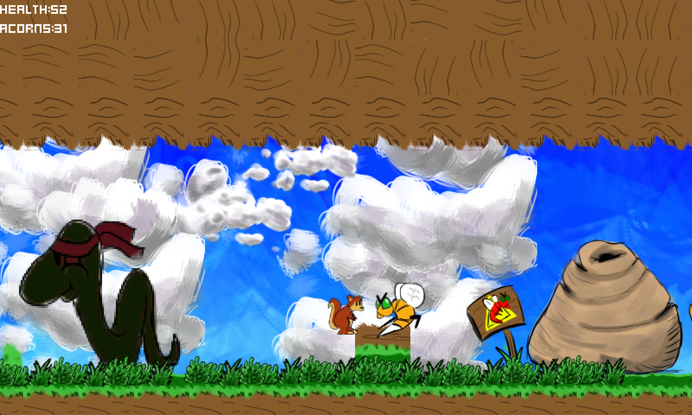

# Ratatoskr

The greatest squirrel of all time: https://en.m.wikipedia.org/wiki/Ratatoskr

Check out the demo this was based from in the asset library: https://godotengine.org/asset-library/asset/120

## Features

- Squirrel with Jetpack
- Squirrel with Axes
- Squirrel with Acorns
- Squirrel with Jump
- Squirrel with Dash
- Non-Squirrels ready to be squashed
- Pixel art visuals
- Sound effects and music

## Screenshots

## Music

[*Viking Rat Oscar*](Assets/Music) by Ratatoskr devs
