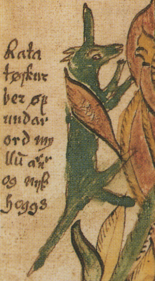

# Ratatoskr

The greatest squirrel of all time: https://en.m.wikipedia.org/wiki/Ratatoskr

Check out the demo this was based from in the asset library: https://godotengine.org/asset-library/asset/120

## Features

- Side-scrolling player controller using [`CharacterBody2D`](https://docs.godotengine.org/en/latest/classes/class_characterbody2d.html).
	- Can walk on and snap to slopes.
	- Can shoot, including while jumping.
- Enemies that crawl on the floor and change direction when they encounter an obstacle.
- Camera that stays within the level’s bounds.
- Supports keyboard and gamepad controls.
- Platforms that can move in any direction.
- Gun that shoots bullets with rigid body (natural) physics.
- Collectible coins.
- Pause and pause menu.
- Pixel art visuals.
- Sound effects and music.

## Screenshots

## Music

[*Pompy*](https://soundcloud.com/madbr/pompy) by Hubert Lamontagne (madbr)
